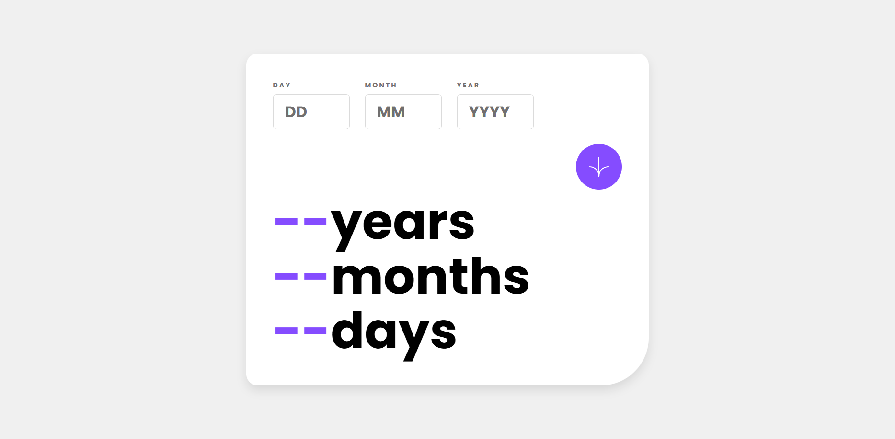

# Age-Calculator-App

Projeto simples em JavaScript que calcula a idade do usuário a partir da data de nascimento, exibindo o resultado em anos, meses e dias.

---

## Funcionalidades

- Inserir dia, mês e ano de nascimento
- Calcular idade em anos, meses e dias
- Validar datas inválidas
- Exibir o resultado automaticamente na tela

---

## Tecnologias utilizadas

- HTML
- CSS
- JavaScript

---

## Objetivo do projeto

Projeto desenvolvido para praticar lógica de programação, manipulação do DOM e eventos em JavaScript.

---

## Autor

Vinicius de Menezes Malta
